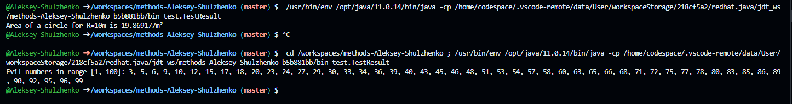

# Знайти всі злі числа між двома заданими числами (метод Calculate має повернути рядок - список таких чисел через кому)

## Exercise.java
````java
package domain;
/**
 * Клас Exercise містить метод для знаходження всіх "злих чисел" 
 * у заданому діапазоні чисел.
 */
public class Exercise {
    /**
     * Метод знаходить усі "злі числа" у заданому діапазоні.
     *
     * @param start початок діапазону (включно)
     * @param end кінець діапазону (включно)
     * @return рядок злі чисел, розділених комами
     */
    public static String Calculate(int start, int end) {
        StringBuilder result = new StringBuilder();
        
        for (int i = start; i <= end; i++) {
            if (isEvil(i)) {
                if (result.length() > 0) {
                    result.append(", ");
                }
                result.append(i);
            }
        }
        return result.toString();
    }
    /**
     * Перевіряє, чи є число "злим" (Evil number).
     * "Злі числа" — це числа, у двійковому представленні яких міститься парна кількість одиниць.
     *
     * @param number число для перевірки
     * @return true, якщо число "зле", інакше false
     */
    private static boolean isEvil(int number) {
        return Integer.bitCount(number) % 2 == 0;
    }
}
````

# TestResult.java
````java
package test;

import domain.Exercise;

public class TestResult {

    public static void main(String[] args) {
        int start = 1;
        int end = 100;

        System.out.println("Evil numbers in range [" + start + ", " + end + "]: " + Exercise.Calculate(start, end));
    }
}

````

# Результат 
